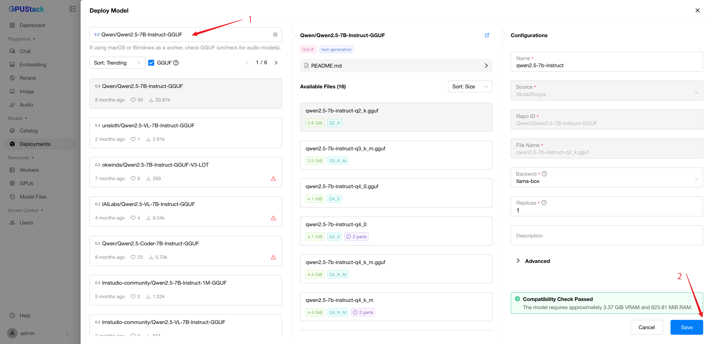
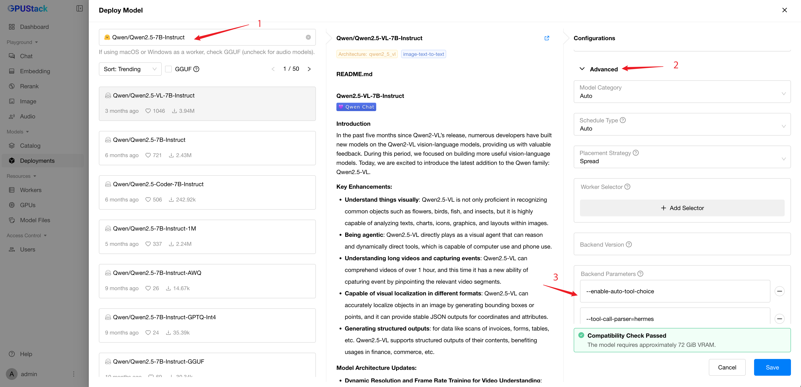

# 使用工具调用进行推理

工具调用使你能够将模型连接到外部工具和系统。这对于为 AI 助手赋能或在你的应用与模型之间构建深度集成非常有用。

在本教程中，你将学习如何在 GPUStack 中设置和使用工具调用，以扩展你的 AI 能力。

!!! note

    1. 工具调用在 [llama-box](../user-guide/inference-backends.md#llama-box) 和 [vLLM](../user-guide/inference-backends.md#vllm) 推理后端中均受支持。
    2. 工具调用本质上是通过提示工程实现的，需要模型经过内化模板的训练以启用该能力。因此，并非所有大语言模型都支持工具调用。

## 先决条件

在继续之前，请确保以下事项：

- 已安装并运行 GPUStack。
- 有一台带 GPU 的 Linux 工作节点可用。本教程将使用模型 [Qwen2.5-7B-Instruct](https://huggingface.co/Qwen/Qwen2.5-7B-Instruct)。该模型至少需要 18GB 显存的 GPU。
- 可访问 Hugging Face 以下载模型文件。

## 步骤 1：部署模型

### 从目录部署

支持工具调用的 LLM 在目录中会标注 `tools` 能力。当你在目录中选择此类模型时，工具调用会默认启用。

### 使用 llama-box 进行自定义部署示例

使用 llama-box 部署 GGUF 模型时，对于支持该功能的模型，工具调用默认启用。

1. 打开 GPUStack 界面的 `Deployments` 页面，点击 `Deploy Model` 按钮。在下拉框中选择 `Hugging Face` 作为模型来源。
2. 勾选 `GGUF` 复选框以按 GGUF 格式过滤模型。
3. 使用搜索栏查找 `Qwen/Qwen2.5-7B-Instruct-GGUF` 模型。
4. 点击 `Save` 按钮部署模型。



### 使用 vLLM 进行自定义部署示例

使用 vLLM 部署模型时，需要通过额外参数启用工具调用。

1. 打开 GPUStack 界面的 `Deployments` 页面，点击 `Deploy Model` 按钮。在下拉框中选择 `Hugging Face` 作为模型来源。
2. 使用搜索栏查找 `Qwen/Qwen2.5-7B-Instruct` 模型。
3. 展开配置中的 `Advanced` 部分，向下滚动至 `Backend Parameters` 部分。
4. 点击 `Add Parameter` 按钮，并添加以下参数：

- `--enable-auto-tool-choice`
- `--tool-call-parser=hermes`

5. 点击 `Save` 按钮部署模型。



部署后，你可以在 `Deployments` 页面监控模型的状态。

## 步骤 2：生成 API 密钥

我们将使用 GPUStack API 与模型交互。为此，你需要生成一个 API 密钥：

1. 将鼠标悬停在用户头像上，进入 `API Keys` 页面。
2. 点击 `New API Key` 按钮。
3. 输入 API 密钥名称并点击 `Save` 按钮。
4. 复制生成的 API 密钥以备后用。

## 步骤 3：进行推理

在模型已部署并且你拥有 API 密钥后，可以通过 GPUStack API 调用模型。以下是一个使用 `curl` 的示例脚本（将 `<your-server-url>` 替换为你的 GPUStack 服务器地址，将 `<your-api-key>` 替换为上一步生成的 API 密钥）：

```bash
export GPUSTACK_SERVER_URL=<your-server-url>
export GPUSTACK_API_KEY=<your-api-key>
curl $GPUSTACK_SERVER_URL/v1-openai/chat/completions \
-H "Content-Type: application/json" \
-H "Authorization: Bearer $GPUSTACK_API_KEY" \
-d '{
  "model": "qwen2.5-7b-instruct",
  "messages": [
    {
      "role": "user",
      "content": "今天波士顿的天气怎么样？"
    }
  ],
  "tools": [
    {
      "type": "function",
      "function": {
        "name": "get_current_weather",
        "description": "获取指定位置的当前天气",
        "parameters": {
          "type": "object",
          "properties": {
            "location": {
              "type": "string",
              "description": "城市和州，例如 San Francisco, CA"
            },
            "unit": {
              "type": "string",
              "enum": ["celsius", "fahrenheit"]
            }
          },
          "required": ["location"]
        }
      }
    }
  ],
  "tool_choice": "auto"
}'
```

示例响应：

```json
{
  "model": "qwen2.5-7b-instruct",
  "choices": [
    {
      "index": 0,
      "message": {
        "role": "assistant",
        "content": null,
        "tool_calls": [
          {
            "id": "chatcmpl-tool-b99d32848b324eaea4bac5a5830d00b8",
            "type": "function",
            "function": {
              "name": "get_current_weather",
              "arguments": "{\"location\": \"Boston, MA\", \"unit\": \"fahrenheit\"}"
            }
          }
        ]
      },
      "finish_reason": "tool_calls"
    }
  ],
  "usage": {
    "prompt_tokens": 212,
    "total_tokens": 242,
    "completion_tokens": 30
  }
}
```