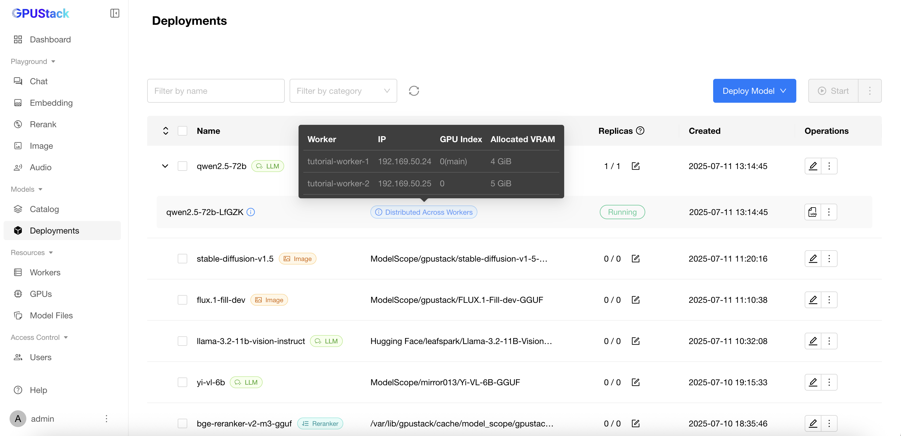

# 跨工作节点执行分布式推理（llama-box）

本教程将带你完成在 GPUStack 中配置并运行跨多个工作节点的分布式推理流程。分布式推理可将计算负载分配给多个工作节点，以便运行更大的语言模型。当单个工作节点的资源（如显存 VRAM）不足以独立运行整个模型时，这种方式尤其有用。

## 前置条件

在开始之前，请确保：

- 已安装并运行一个多节点 GPUStack 集群。
- 能够访问 Hugging Face 以下载模型文件。

本教程假设集群包含两个节点，每个节点配备一张 NVIDIA P40 GPU（22GB 显存），如下图所示：


我们计划运行一个单个工作节点显存无法容纳的大语言模型。这里使用 `Qwen/Qwen2.5-72B-Instruct` 模型，并选择 `q2_k` 量化格式。可通过 [gguf-parser](https://github.com/gpustack/gguf-parser-go) 工具估算运行该模型所需的资源：

```bash
gguf-parser --hf-repo Qwen/Qwen2.5-72B-Instruct-GGUF --hf-file qwen2.5-72b-instruct-q2_k-00001-of-00007.gguf --ctx-size=8192 --in-short --skip-architecture --skip-metadata --skip-tokenizer
```

```
+--------------------------------------------------------------------------------------+
| ESTIMATE                                                                             |
+----------------------------------------------+---------------------------------------+
|                      RAM                     |                 VRAM 0                |
+--------------------+------------+------------+----------------+----------+-----------+
| LAYERS (I + T + O) |     UMA    |   NONUMA   | LAYERS (T + O) |    UMA   |   NONUMA  |
+--------------------+------------+------------+----------------+----------+-----------+
|      1 + 0 + 0     | 259.89 MiB | 409.89 MiB |     80 + 1     | 2.50 GiB | 28.89 GiB |
+--------------------+------------+------------+----------------+----------+-----------+
```

从输出可以看出，该模型的估算显存需求超出了每个工作节点可用的 22GB 显存。因此，我们需要在多个工作节点之间分布式地进行推理，才能成功运行该模型。

### 步骤 1：部署模型

按照以下步骤从 Hugging Face 部署模型，以启用分布式推理：

1. 进入 GPUStack UI 的 `Deployments` 页面。
2. 点击 `Deploy Model` 按钮。
3. 在下拉菜单中选择 `Hugging Face` 作为模型来源。
4. 勾选 `GGUF` 复选框，以按 GGUF 格式筛选模型。
5. 使用左上角的搜索栏搜索模型名称 `Qwen/Qwen2.5-72B-Instruct-GGUF`。
6. 在 `Available Files` 区域选择 `q2_k` 量化格式。
7. 展开 `Advanced` 区域并向下滚动，确认 `Allow Distributed Inference Across Workers` 选项已启用（默认启用）。GPUStack 会评估集群的可用资源，并在需要时以分布式方式运行模型。
8. 点击 `Save` 按钮以部署模型。


### 步骤 2：验证模型部署

模型部署完成后，前往 `Deployments` 页面进行验证，你可以查看模型如何跨多个工作节点运行的详细信息。



你也可以进入 `Workers` 或 `GPUs` 页面查看工作节点与 GPU 的资源使用情况。


最后，前往 `Playground` 页面与模型交互，确认一切运行正常。

