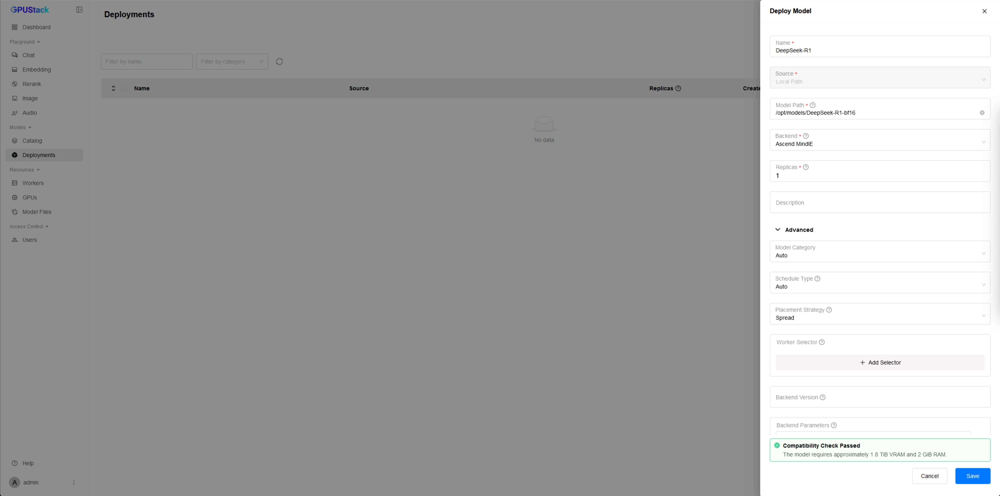
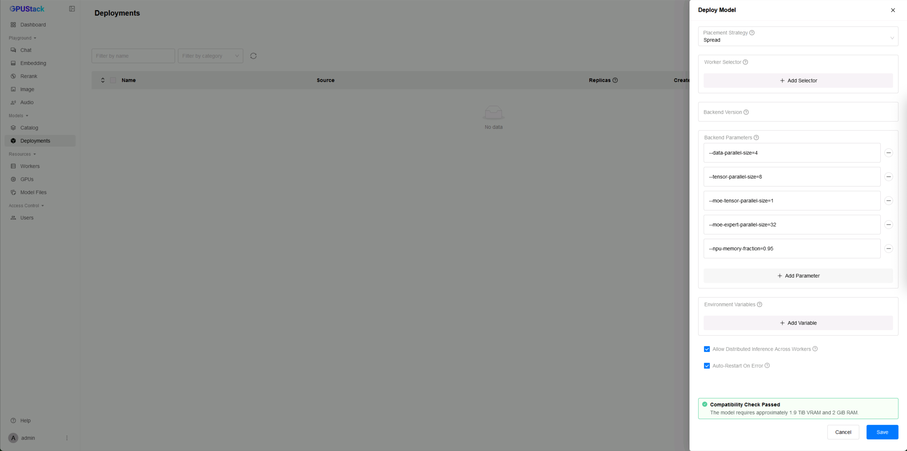

# 使用分布式 Ascend MindIE 运行 DeepSeek R1 671B

本教程将指导你在 GPUStack 集群上，使用分布式 Ascend MindIE 配置并运行原始的 DeepSeek R1 671B。

由于模型体量极大，通常需要在多台工作节点上进行分布式推理。

GPUStack 可通过 Ascend MindIE 轻松搭建和编排分布式推理，使得以最少的手动配置运行像 DeepSeek R1 这样的超大模型成为可能。

## 先决条件

开始之前，请确保满足以下要求：

- 你能够访问足够数量的 Linux 节点，并且每个节点都配备所需的 Ascend Atlas AI 处理器。例如：

<div class="center-table" markdown>

| 服务器（NPU）                | 节点数量 |
| --------------------------- | -------- |
| Atlas 800T A2 (910B3 x 8)   | 4        |

</div>

- 所有节点需要支持华为集合通信自适应协议（HCCP），安装华为集合通信库（HCCL），并启用华为缓存一致性系统（HCCS）。
- 模型文件需在每个节点的相同路径下准备好。尽管 GPUStack 支持在运行时自动下载模型，但根据网络速度不同，该过程可能耗时较长，因此推荐预先下载。

!!! note

    - 本教程假设为 4 个节点，每个节点配备 8 张 910B3 NPU，并通过 200G 华为缓存一致性网络（HCCN）连接。
    - Atlas NPU 不支持 DeepSeek R1 最初使用的 FP8 精度。因此我们使用来自 [Unsloth](https://huggingface.co/unsloth/DeepSeek-R1-BF16) 的 BF16 版本。

## 步骤 1：安装 GPUStack 服务端

本教程使用 Docker 安装 GPUStack。你也可以选择其他安装方式。

使用以下命令启动 GPUStack 服务端：

```bash
docker run -d --name gpustack \
    --restart=unless-stopped \
    --device /dev/davinci0 \
    --device /dev/davinci1 \
    --device /dev/davinci2 \
    --device /dev/davinci3 \
    --device /dev/davinci4 \
    --device /dev/davinci5 \
    --device /dev/davinci6 \
    --device /dev/davinci7 \
    --device /dev/davinci_manager \
    --device /dev/devmm_svm \
    --device /dev/hisi_hdc \
    -v /usr/local/dcmi:/usr/local/dcmi \
    -v /usr/local/bin/npu-smi:/usr/local/bin/npu-smi \
    -v /usr/local/Ascend/driver:/usr/local/Ascend/driver:ro \
    -v /usr/local/Ascend/firmware:/usr/local/Ascend/firmware:ro \
    -v /etc/hccn.conf:/etc/hccn.conf:ro \
    -v /etc/ascend_install.info:/etc/ascend_install.info:ro \
    -v gpustack-data:/var/lib/gpustack \
    -v /path/to/your/model:/path/to/your/model \
    --shm-size=1g \
    --network=host \
    --ipc=host \
    gpustack/gpustack:latest-npu
```

!!! note

    - 将 `/path/to/your/model` 替换为系统中存放 DeepSeek R1 模型文件的实际路径。
    - 确保系统已正确安装并配置 `npu-smi` 工具，它用于发现 NPU 设备。
      如果 `npu-smi` 位于其他路径，请将 `/usr/local/bin/npu-smi:/usr/local/bin/npu-smi` 替换为实际路径，
      例如：`/path/to/your/npu-smi:/usr/local/bin/npu-smi`。
    - 确保系统已正确安装并配置 `hccn_tool` 工具，它用于发现 HCCN 网络通信。
      如位于其他路径，请在 `-v` 选项中加入 `/path/to/your/hccn_tool:/usr/local/Ascend/driver/tools/hccn_tool`。

当 GPUStack 服务端启动并运行后，执行以下命令获取初始管理员密码以及用于工作节点注册的令牌：

```bash
docker exec gpustack cat /var/lib/gpustack/initial_admin_password
docker exec gpustack cat /var/lib/gpustack/token
```

## 步骤 2：安装 GPUStack 工作节点

在每个工作节点上，运行以下命令启动 GPUStack worker：

```bash
docker run -d --name gpustack \
    --restart=unless-stopped \
    --device /dev/davinci0 \
    --device /dev/davinci1 \
    --device /dev/davinci2 \
    --device /dev/davinci3 \
    --device /dev/davinci4 \
    --device /dev/davinci5 \
    --device /dev/davinci6 \
    --device /dev/davinci7 \
    --device /dev/davinci_manager \
    --device /dev/devmm_svm \
    --device /dev/hisi_hdc \
    -v /usr/local/dcmi:/usr/local/dcmi \
    -v /usr/local/bin/npu-smi:/usr/local/bin/npu-smi \
    -v /usr/local/Ascend/driver:/usr/local/Ascend/driver:ro \
    -v /usr/local/Ascend/firmware:/usr/local/Ascend/firmware:ro \
    -v /etc/hccn.conf:/etc/hccn.conf:ro \
    -v /etc/ascend_install.info:/etc/ascend_install.info:ro \
    -v gpustack-data:/var/lib/gpustack \
    -v /path/to/your/model:/path/to/your/model \
    --shm-size=1g \
    --network=host \
    --ipc=host \
    gpustack/gpustack:latest-npu \
    --server-url http://your_gpustack_server_ip_or_hostname \
    --token your_gpustack_token
```

!!! note

    - 请根据实际情况替换占位路径、IP 地址/主机名以及令牌。
    - 将 `/path/to/your/model` 替换为系统中存放 DeepSeek R1 模型文件的实际路径。
    - 确保系统已正确安装并配置 `npu-smi` 工具，它用于发现 NPU 设备。
      如果 `npu-smi` 位于其他路径，请将 `/usr/local/bin/npu-smi:/usr/local/bin/npu-smi` 替换为实际路径，
      例如：`/path/to/your/npu-smi:/usr/local/bin/npu-smi`。
    - 确保系统已正确安装并配置 `hccn_tool` 工具，它用于发现 HCCN 网络通信。
      如位于其他路径，请在 `-v` 选项中加入 `/path/to/your/hccn_tool:/usr/local/Ascend/driver/tools/hccn_tool`。

## 步骤 3：访问 GPUStack 界面

当服务端和所有工作节点均已运行后，通过浏览器访问：

```
http://your_gpustack_server_ip_or_hostname
```

使用用户名 `admin` 和在步骤 1 中获得的密码登录。进入 `Workers` 页面，确认所有工作节点为 Ready 状态，并且其 GPU 已列出。


## 步骤 4：部署 DeepSeek R1 模型

1. 进入 `Deployments` 页面。
2. 点击 `Deploy Model`。
3. 在来源选择 `Local Path`。
4. 在 `Name` 字段中输入名称（例如 `DeepSeek-R1`）。
5. 将 `Model Path` 指定为每个工作节点上 DeepSeek R1 模型文件所在的目录。
6. 确保 `Backend` 设置为 `Ascend MindIE`。
7. 展开 `Advanced`，在 `Backend Parameters` 中追加以下参数：
   - `--data-parallel-size=4`
   - `--tensor-parallel-size=8`
   - `--moe-tensor-parallel-size=1`
   - `--moe-expert-parallel-size=32`
   - `--npu-memory-fraction=0.95`，由于我们使用数据并行，内存占比应设置为 0.95，以确保所有 NPU 的内存高效利用。
8. 通过兼容性检查后，点击 `Save` 进行部署。




## 步骤 5：监控部署

可在 `Deployments` 页面监控部署状态。将鼠标悬停在 `distributed across workers` 上查看 GPU 与工作节点的占用情况。点击 `View Logs` 查看实时日志以了解模型加载进度。模型加载可能需要几分钟。


模型运行后，前往 `Workers` 页面查看 GPU 利用率。在上述设置下，Ascend MindIE 会使用 95% 的 NPU 内存。


## 步骤 6：通过 Playground 进行推理

当模型成功部署并运行后，可使用 GPUStack Playground 进行测试。

1. 导航到 `Playground` -> `Chat`。
2. 若仅部署了一个模型，会默认选中该模型；否则从下拉菜单中选择 `DeepSeek-R1`。
3. 输入提示词并与模型交互。


你也可以使用 `Compare` 选项卡测试并发推理场景。


至此，你已在 GPUStack 集群上使用分布式 Ascend MindIE 成功部署并运行 DeepSeek R1 671B。欢迎在你的应用中探索该模型的性能与能力。

如需进一步帮助，请联系 GPUStack 社区或支持团队。