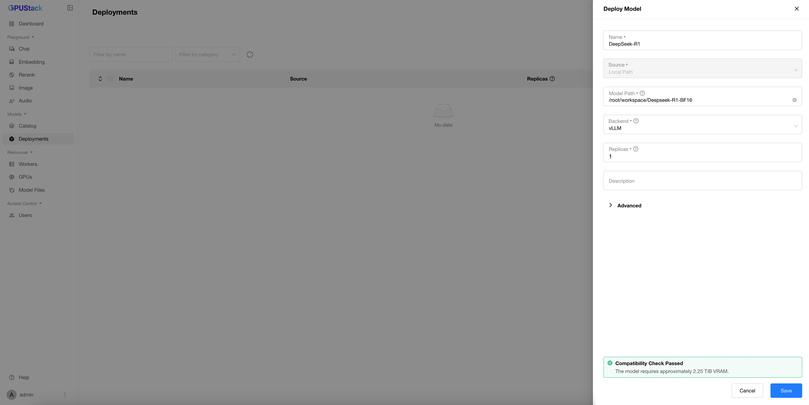
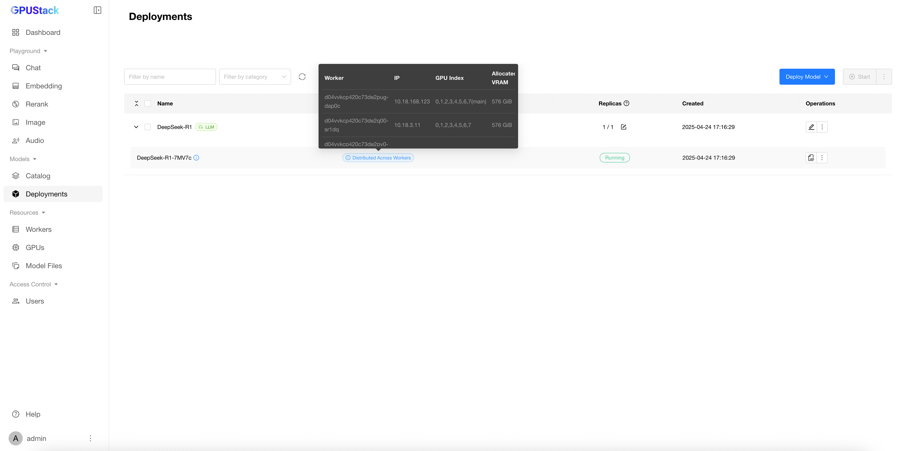
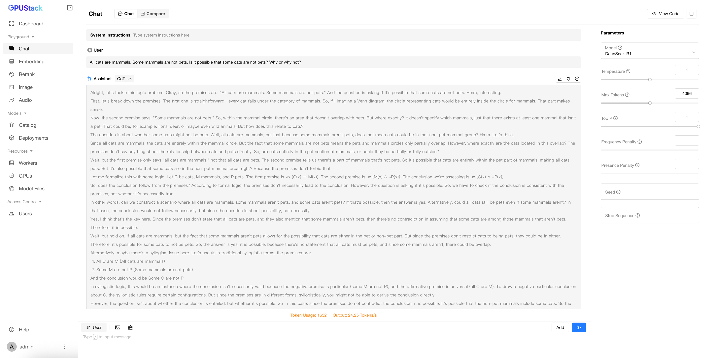

# 使用分布式 vLLM 运行 DeepSeek R1 671B

本教程将指导你在 GPUStack 集群上使用分布式 vLLM 配置并运行未量化的 DeepSeek R1 671B。由于模型体量极大，通常需要在多个工作节点上进行分布式推理。

GPUStack 通过 vLLM 简化了分布式推理的部署与编排，使得以最少的手动配置即可运行像 DeepSeek R1 这样的大规模模型。

## 前置条件

开始之前，请确认满足以下要求：

- 你可以访问足够数量的 Linux 节点，并且每个节点配备所需的 GPU。例如：

<div class="center-table" markdown>

| **GPU**          | **节点数量** |
| ---------------- | ------------ |
| H100/H800:8      | 2            |
| A100/A800-80GB:8 | 4            |
| A100/A800:8      | 8            |

</div>
- 建议使用 NVLink 或 InfiniBand 等高速互联以获得最佳性能。
- 应将模型文件下载到每个节点上的相同路径。虽然 GPUStack 支持按需下载模型，但根据网络速度，这可能耗时较长，因此推荐预先下载。

!!! note

    - 本教程假设使用 4 个节点，每个节点配备 8 张 A800-80GB GPU，并通过 200G InfiniBand 互联。
    - A100/A800 GPU 不支持 DeepSeek R1 最初使用的 FP8 精度。因此，我们使用来自 [Unsloth](https://huggingface.co/unsloth/DeepSeek-R1-BF16) 的 BF16 版本。

## 步骤 1：安装 GPUStack 服务器

本教程中我们将使用 Docker 安装 GPUStack。你也可以选择其他安装方式。

使用以下命令启动 GPUStack 服务器：

```bash
docker run -d --name gpustack \
    --restart=unless-stopped \
    --gpus all \
    --network=host \
    --ipc=host \
    -v gpustack-data:/var/lib/gpustack \
	-v /path/to/your/model:/path/to/your/model \
	-e NCCL_SOCKET_IFNAME=eth2 \
	-e GLOO_SOCKET_IFNAME=eth2 \
    gpustack/gpustack --enable-ray
```

!!! note

    - 将 /path/to/your/model 替换为实际路径。
    - 将 NCCL_SOCKET_IFNAME 和 GLOO_SOCKET_IFNAME 设置为用于跨节点通信的网络接口。示例中使用 eth2。
    - --enable-ray 参数启用 Ray 以进行分布式推理，这是 vLLM 所必需的。

当 GPUStack 服务器启动并运行后，执行以下命令获取初始管理员密码和用于工作节点注册的令牌：

```bash
docker exec gpustack cat /var/lib/gpustack/initial_admin_password
docker exec gpustack cat /var/lib/gpustack/token
```

## 步骤 2：安装 GPUStack 工作节点

在每个工作节点上，运行以下命令启动一个 GPUStack 工作节点：

```bash
docker run -d --name gpustack \
    --restart=unless-stopped \
    --gpus all \
    --network=host \
    --ipc=host \
    -v gpustack-data:/var/lib/gpustack \
	-v /path/to/your/model:/path/to/your/model \
	-e NCCL_SOCKET_IFNAME=eth2 \
	-e GLOO_SOCKET_IFNAME=eth2 \
    gpustack/gpustack \
    --server-url http://your_gpustack_server_ip_or_hostname \
	--token your_gpustack_token \
	--enable-ray
```

!!! note

    - 请将占位路径、IP 地址/主机名和令牌替换为实际值。
    - 确保模型路径与服务器上的一致，且在所有工作节点上均为有效路径。

## 步骤 3：访问 GPUStack 界面

当服务器和所有工作节点都运行后，通过浏览器访问 GPUStack 界面：

```
http://your_gpustack_server_ip_or_hostname
```

使用用户名 admin 和步骤 1 中获取的密码登录。前往 Workers 页面，确认所有工作节点状态为 Ready，且其 GPU 已正确显示。


## 步骤 4：部署 DeepSeek R1 模型

1. 进入 Deployments 页面。
2. 点击 Deploy Model。
3. 选择 Local Path 作为来源。
4. 在 Name 字段中输入名称（例如：DeepSeek-R1）。
5. 将 Model Path 指定为每个工作节点上 DeepSeek R1 模型文件所在的目录。
6. 确保 Backend 设置为 vLLM。
7. 通过兼容性检查后，点击 Save 进行部署。



## 步骤 5：监控部署

你可以在 Deployments 页面监控部署状态。将鼠标悬停在 distributed across workers 上可查看 GPU 与工作节点的使用情况。点击 View Logs 可查看实时日志以了解模型加载进度。加载模型可能需要几分钟时间。



模型运行后，前往 Workers 页面查看 GPU 使用率。默认情况下，vLLM 会使用 90% 的显存。你可以在模型配置中进行调整。


## 步骤 6：通过 Playground 进行推理

当模型部署并运行后，可以使用 GPUStack 的 Playground 进行测试。

1. 前往 Playground -> Chat。
2. 如果只部署了一个模型，它会被默认选中。否则，请通过下拉菜单选择 DeepSeek-R1。
3. 输入提示词，与模型交互。



你也可以使用 Compare 标签页测试并发推理场景。


至此，你已成功在 GPUStack 集群上使用分布式 vLLM 部署并运行 DeepSeek R1 671B。欢迎在你的应用中探索该模型的性能与能力。

如需进一步帮助，欢迎联系 GPUStack 社区或支持团队。