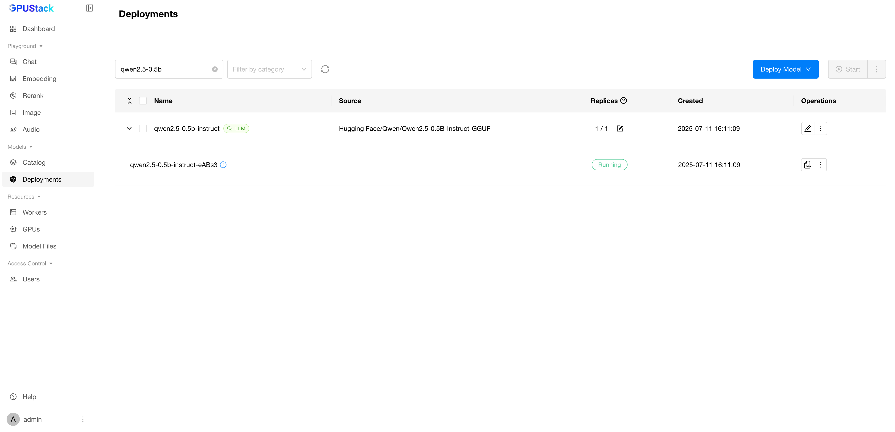

# 在搭载 Snapdragon X 的 Copilot+ PC 上运行推理

GPUStack 支持在 ARM64 Windows 上运行，从而可在基于 Snapdragon X 的 Copilot+ PC 上使用。

!!! note

    在 Snapdragon X 设备上仅支持基于 CPU 的推理。GPUStack 目前不支持在该平台上使用 GPU 或 NPU 加速。

## 先决条件

- 一台搭载 Snapdragon X 的 Copilot+ PC。本教程使用 Dell XPS 13 9345。
- 安装 **AMD64** Python（版本 3.10 至 3.12）。[查看详情](../installation/installation-requirements.md#supported-architectures)

## 安装 GPUStack

以管理员身份运行 PowerShell（避免使用 PowerShell ISE），然后运行以下命令安装 GPUStack：

```powershell

Invoke-Expression (Invoke-WebRequest -Uri "https://get.gpustack.ai" -UseBasicParsing).Content

```

安装完成后，按照屏幕上的指引获取凭据并登录 GPUStack UI。

## 部署模型

1. 在 GPUStack UI 中导航至 `Deployments` 页面。
2. 点击 `Deploy Model` 按钮，并在下拉菜单中选择 `Hugging Face`。
3. 启用 `GGUF` 复选框，以按 GGUF 格式筛选模型。
4. 使用左上角的搜索栏搜索模型名称 `Qwen/Qwen2.5-0.5B-Instruct-GGUF`。
5. 点击 `Save` 以部署模型。

部署完成后，您可以在 `Deployments` 页面监控模型部署的状态。



## 运行推理

在 GPUStack UI 中导航至 `Playground` 页面，您可以在此与已部署的模型进行交互。

