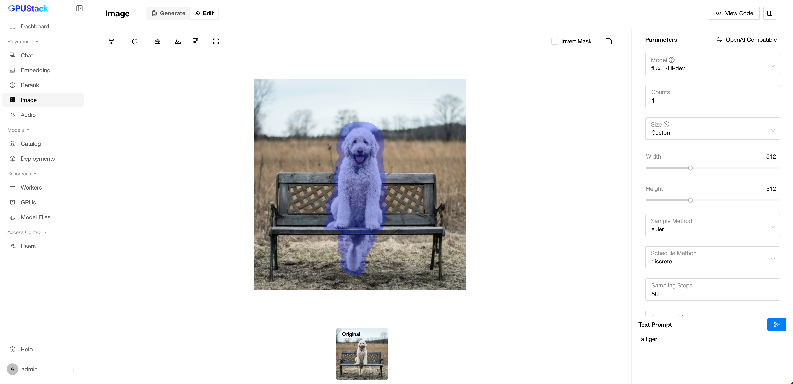
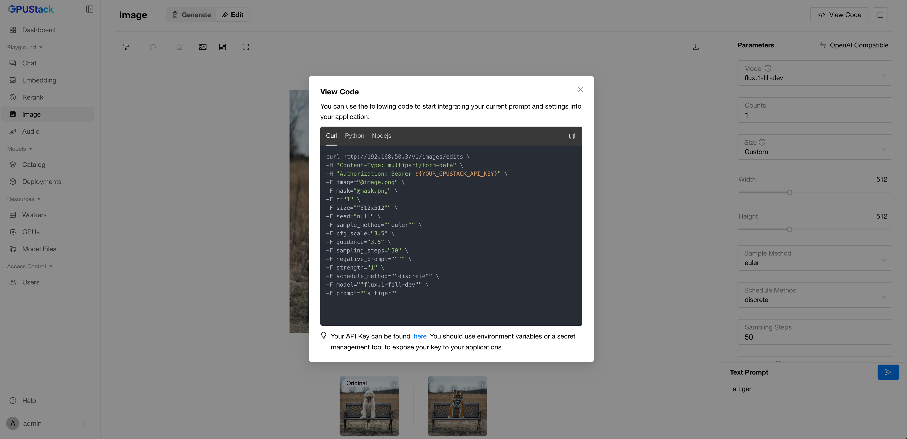

# 编辑图像

你可以使用图像模型通过选择图像中要编辑的区域并描述期望的更改来编辑图像。模型会根据你的描述生成编辑后的图像。

本指南演示如何在 GPUStack 中编辑图像。

## 前提条件

在开始之前，请确认你具备以下条件：

- 至少 24 GB 显存的 GPU。
- 可访问 Hugging Face 以下载模型文件。
- 已安装并运行 GPUStack。若未安装，请参阅[快速上手指南](../quickstart.md)。

在本指南中，我们将使用 `Q8_0` 量化的 `FLUX.1-Fill-dev` 模型来编辑图像。

## 第一步：部署模型

按以下步骤从 Hugging Face 部署模型：

1. 在 GPUStack 界面进入 `Catalog` 页面。
2. 搜索并选择 `FLUX.1 Fill Dev` 模型。
3. 在弹窗中选择 `Q8_0` 量化。
4. 保持其他设置为默认，点击 `Save` 按钮部署模型。


部署完成后，你可以在 `Deployments` 页面监控模型部署状态。

## 第二步：使用模型编辑图像

1. 在 GPUStack 界面进入 `Playground` > `Image` 页面。
2. 点击顶部的 `Edit` 选项卡。
3. 确认右上角 `Model` 下拉菜单中已选择已部署的模型。
4. 点击中央上传区域，上传[示例图像](../../assets//using-models/editing-images/image-edit-example.png)。
5. 在示例图像的头发区域绘制遮罩。
6. 在 `Text Prompt` 字段输入以下文本提示：
   ```
   a tiger
   ```
7. 点击 `Submit` 按钮生成编辑后的图像。



生成的图像将显示在界面中。由于种子和生成过程中的随机性，你的图像可能会有所不同。


如果你希望复现上述结果，可以使用以下参数：

```
Size: 512x512(1:1)
Sample Method: euler
Schedule Method: discrete
Sampling Steps: 50
Guidance: 3.5
CFG Scale: 3.5
Strength: 1.0
Seed: 656821733471329
Text Prompt: a tiger
```

## 第三步：使用编辑图像 API

点击 `View Code` 按钮，查看以编程方式使用编辑图像 API 的示例代码片段。

