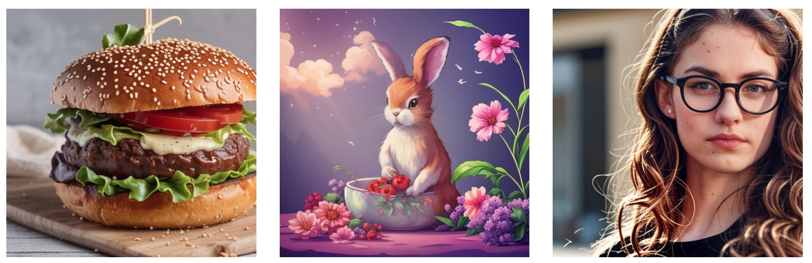

# 图像生成模型推荐参数

> GPUStack 目前不支持非一体式（基础模型、文本编码器与 VAE 合并）的 GGUF 图像生成模型。请参考支持的模型列表：
>
> - [Hugging Face 合集](https://huggingface.co/collections/gpustack/image-672dafeb2fa0d02dbe2539a9)
>
> - [ModelScope 合集](https://modelscope.cn/collections/Image-fab3d241f8a641)

图像生成模型的核心参数是获得理想输出的关键，包括 `Prompt`、`Seed`、`Resolution`、`Sampler`、`Scheduler`、`Sampling Steps` 与 `CFG scale`。
不同模型的参数设置可能有所差异。为便于快速上手并生成满意结果，下面提供一些参数配置的参考值。

## FLUX.1-dev

对于 FLUX 模型，建议禁用 CFG（CFG=1）以获得更好效果。

参考设置：

| 参数 | 取值       |
| ---- | ---------- |
| Size | 1024x1024  |
| Sampler | euler   |
| Scheduler | discrete |
| Steps | 20        |
| CFG | 1.0         |

推荐采样器：euler, heun, ipndm, ipndm_v

推荐调度器：discrete

✏️**试一试！**

```text
Prompt: 一只袋鼠手里拿着啤酒，戴着滑雪护目镜，激情四溢地唱着滑稽的歌曲。
Size: 1024x1024
Sampler: euler
Scheduler: discrete
Steps: 20
CFG: 1.0
Seed: 838887451
```


### 使用 LoRA

**配置**：编辑模型 -> 高级 -> 后端参数 -> 添加 `--lora=<path/to/your/lora_file>`


上排为原始图像，下排为使用 LoRA 生成的对应图像。


!!! note

    LoRA 目前为实验性功能。并非所有模型或 LoRA 文件都可兼容。

## FLUX.1-schnell

对于 FLUX 模型，建议禁用 CFG（CFG=1）以获得更好效果。

参考设置：

| 参数 | 取值       |
| ---- | ---------- |
| Size | 1024x1024  |
| Sampler | euler   |
| Scheduler | discrete |
| Steps | 2-4       |
| CFG | 1.0         |

推荐采样器：euler, dpm++2mv2, ipndm_v

推荐调度器：discrete

✏️**试一试！**

```text
Prompt: 一只顽皮的雪貂带着调皮的笑容，把自己挤进一个大玻璃罐里，周围环绕着五颜六色的糖果。罐子放在一张木桌上，温暖的阳光从附近的窗户洒入温馨的厨房。
Size: 1024x1024
Sampler: euler
Scheduler: discrete
Steps: 3
CFG: 1.0
Seed: 1565801500
```


## Stable-Diffusion-v3-5-Large

参考设置：

| 参数 | 取值       |
| ---- | ---------- |
| Size | 1024x1024  |
| Sampler | euler   |
| Scheduler | discrete |
| Steps | 25        |
| CFG | 4.5         |

推荐采样器：dpm++2m, ipndm, ipndm_v, dpm++2mv2, eluer, heun, dpm2

推荐调度器：discrete

✏️**试一试！**

```text
Prompt: 幸运花的波普艺术风格，粉色配色方案；可爱快乐的女孩角色戴着超大耳机，闭着眼睛在空中微笑着听音乐；色彩鲜艳的日本动漫卡通插画，粗线条和明亮色彩；背景上方有彩色文字“GPUStack”；高分辨率，细节丰富。
Size: 1024x1024
Sampler: dpm++2m
Scheduler: discrete
Steps: 25
CFG: 5
Seed: 3520225659
```


## Stable-Diffusion-v3-5-Large-Turbo

对于 Turbo 模型，建议禁用 CFG（CFG=1）以获得更好效果。

参考设置：

| 参数 | 取值                 |
| ---- | -------------------- |
| Size | 1024x1024            |
| Sampler | euler/dpm++2m     |
| Scheduler | discrete/exponential |
| Steps | 5/15-20             |
| CFG | 1.0                   |

推荐采样器：euler, ipndm, ipndm_v, dpm++2mv2, heun, dpm2, dpm++2m

推荐调度器：discrete, karras, exponential

✏️**试一试！**

```text
Prompt: 这幅梦幻般的数字艺术捕捉了一只在郁郁葱葱的热带雨林中的、色彩斑斓如万花筒般的鸟。
Size: 768x1024
Sampler: heun
Scheduler: karras
Steps: 15
CFG: 1.0
Seed: 2536656539
```


## Stable-Diffusion-v3-5-Medium

参考设置：

| 参数 | 取值    |
| ---- | ------- |
| Size | 768x1024 |
| Sampler | euler |
| Scheduler | discrete |
| Steps | 28     |
| CFG | 4.5      |

推荐采样器：euler, ipndm, ipndm_v, dpm++2mv2, heun, dpm2, dpm++2m

推荐调度器：discrete

✏️**试一试！**

```text
Prompt: 毛绒玩具，一盒薯条，粉色包，长长的薯条，微笑表情，圆眼睛，笑嘴，色彩明快，构图简洁，干净背景，jellycat 风格，
Negative Prompt: ng_deepnegative_v1_75t,(badhandv4:1.2),EasyNegative,(worst quality:2)
Size: 768x1024
Sampler: euler
Scheduler: discrete
Steps: 28
CFG: 4.5
Seed: 3353126565
```


## Stable-Diffusion-v3-Medium

参考设置：

| 参数 | 取值       |
| ---- | ---------- |
| Size | 1024x1024  |
| Sampler | euler   |
| Scheduler | discrete |
| Steps | 25        |
| CFG | 4.0         |

推荐采样器：euler, ipndm, ipndm_v, dpm++2mv2, heun, dpm2, dpm++2m

推荐调度器：discrete

✏️**试一试！**

```text
Prompt: 一把由西瓜打造的吉他，写实、特写、超高清、数字艺术，带有烟雾和冰块，柔和光线，舞台光影的戏剧性效果，粉彩美学滤镜，延时摄影，微距摄影，超高分辨率，完美设计构图，超现实主义，超强想象力，超写实、超高清质量
Size: 768x1280
Sampler: euler
Scheduler: discrete
Steps: 30
CFG: 5.0
Seed: 1937760054
```

!!! tip

    默认最大图片高度为 1024。如需增加，请编辑模型并在高级设置中添加后端参数 --image-max-height=1280。


## SDXL-base-v1.0

参考设置：

| 参数 | 取值     |
| ---- | -------- |
| Size | 1024x1024 |
| Sampler | dpm++2m |
| Scheduler | karras |
| Steps | 25       |
| CFG | 5.0        |

推荐采样器：euler, ipndm, ipndm_v, dpm++2mv2, heun, dpm2, dpm++2m

推荐调度器：discrete, karras, exponential

✏️**试一试！**

```text
Prompt: 海边的野草随风摇曳，超写实，恢弘史诗般的风景，华美的远古仪式，色彩鲜活，唯美东方奇幻，明媚阳光，粉色桃花，白天视角。
Negative Prompt: ng_deepnegative_v1_75t,(badhandv4:1.2),EasyNegative,(worst quality:2),
Size: 768x1280
Sampler: dpm++2m
Scheduler: exponential
Steps: 30
CFG: 5.0
Seed: 3754742591
```


## Stable-Diffusion-v2-1-Turbo

对于 Turbo 模型，建议禁用 CFG（CFG=1）以获得更好效果。

参考设置：

| 参数 | 取值    |
| ---- | ------- |
| Size | 512x512 |
| Sampler | euler_a |
| Scheduler | discrete |
| Steps | 6      |
| CFG | 1.0      |

推荐采样器：eluer_a, dmp++2s, lcm

推荐调度器：discrete, karras, exponential, ays, gits

✏️**试一试！**

```text
Prompt: 一个汉堡肉饼，配有底部面包、生菜和番茄。
Size: 512x512
Sampler: euler_a
Scheduler: discrete
Steps: 6
CFG: 1.0
Seed: 1375548153
```



!!! note

    以上参数仅供参考。最佳设置可能因具体情况而异，请根据需求适当调整。