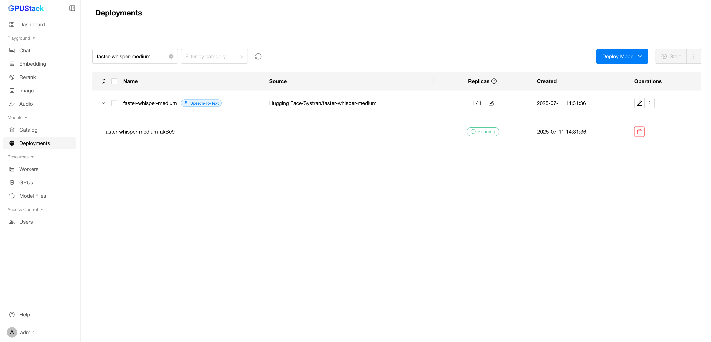
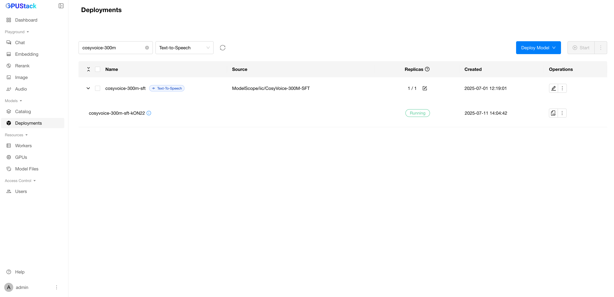
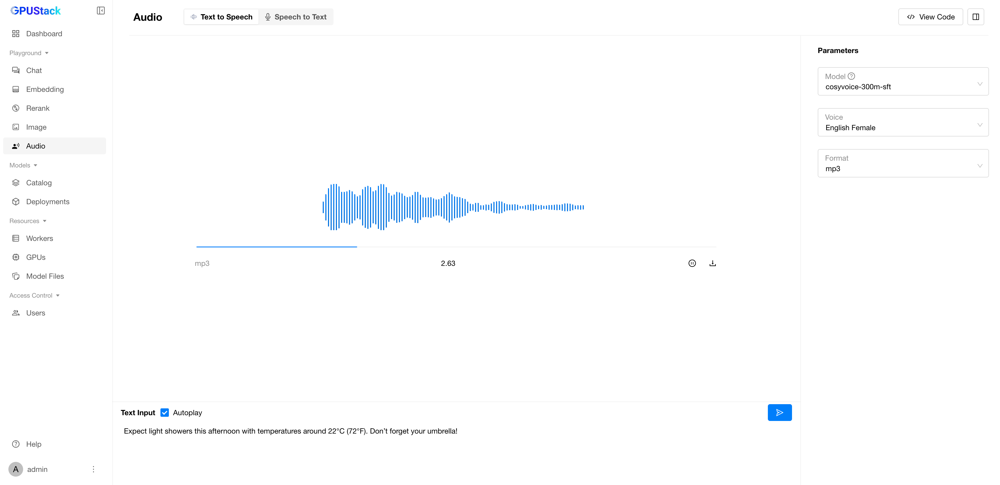

# 使用音频模型

GPUStack 支持运行语音转文本（Speech-to-Text）和文本转语音（Text-to-Speech）模型。语音转文本模型将多种语言的音频输入转换为书面文本，而文本转语音模型则将书面文本转换为自然且富有表现力的语音。

在本指南中，我们将演示如何在 GPUStack 中部署和使用语音转文本与文本转语音模型。

## 先决条件

在开始之前，请确保具备以下条件：

- 具有 AMD64 架构的 Linux 系统或 macOS。
- 可访问 Hugging Face 以下载模型文件。
- 已安装并运行 GPUStack。如未安装，请参阅[快速入门指南](../quickstart.md)。

## 运行语音转文本模型

### 步骤 1：部署语音转文本模型

按以下步骤从 Hugging Face 部署模型：

1. 在 GPUStack 界面中导航到 `Deployments` 页面。
2. 点击 `Deploy Model` 按钮。
3. 在下拉菜单中选择 `Hugging Face` 作为模型来源。
4. 在左上角的搜索栏中搜索模型名称 `Systran/faster-whisper-medium`。
5. 保持其余设置为默认，点击 `Save` 按钮部署模型。

部署完成后，您可以在 `Deployments` 页面监控模型部署状态。

### 步骤 2：与语音转文本模型交互

1. 在 GPUStack 界面中前往 `Playground` > `Audio` 页面。
2. 选择 `Speech to Text` 选项卡。
3. 在右上角的下拉菜单中选择已部署的模型。
4. 点击 `Upload` 按钮上传音频文件，或点击 `Microphone` 按钮录制音频。
5. 点击 `Generate Text Content` 按钮生成文本。

## 运行文本转语音模型

### 步骤 1：部署文本转语音模型

按以下步骤从 Hugging Face 部署模型：

1. 在 GPUStack 界面中导航到 `Deployments` 页面。
2. 点击 `Deploy Model` 按钮。
3. 在下拉菜单中选择 `Hugging Face` 作为模型来源。
4. 在左上角的搜索栏中搜索模型名称 `gpustack/CosyVoice-300M`。
5. 保持其余设置为默认，点击 `Save` 按钮部署模型。

部署完成后，您可以在 `Deployments` 页面监控模型部署状态。

### 步骤 2：与文本转语音模型交互

1. 在 GPUStack 界面中前往 `Playground` > `Audio` 页面。
2. 选择 `Text to Speech` 选项卡。
3. 在右上角的下拉菜单中选择已部署的模型，然后配置音色与输出音频格式。
4. 输入要生成的文本。
5. 点击 `Submit` 按钮生成文本。

