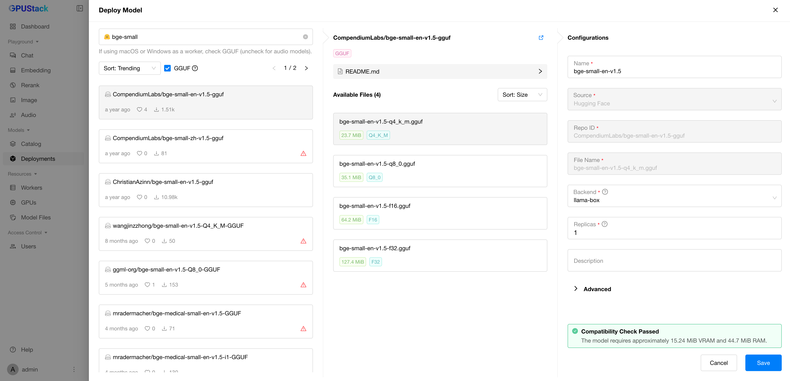
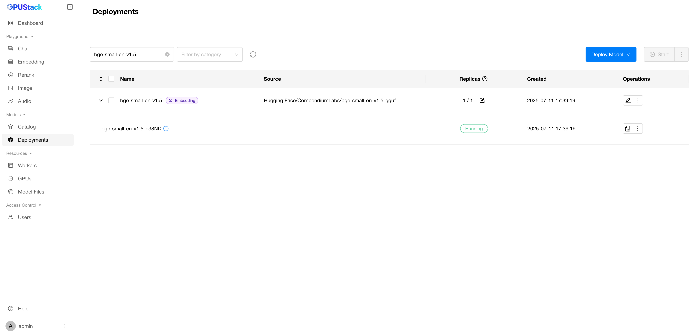

# 使用嵌入模型

**文本嵌入**是对文本的数值表示，能够捕捉语义含义，使机器理解不同文本之间的关系和相似性。简单来说，它将文本转换为连续空间中的向量，语义相似的文本在该空间中彼此更接近。文本嵌入广泛应用于自然语言处理、信息检索和推荐系统等场景。

在本指南中，我们将演示如何在 GPUStack 中部署嵌入模型，并使用已部署的模型生成文本嵌入。

## 前提条件

开始之前，请确保：

- GPUStack 已安装并正在运行。如未安装，请参阅[快速入门指南](../quickstart.md)。
- 可以访问 Hugging Face 以下载模型文件。

## 步骤 1：部署模型

按照以下步骤从 Hugging Face 部署模型：

1. 在 GPUStack UI 中导航到 `Deployments` 页面。
2. 点击 `Deploy Model` 按钮。
3. 在下拉菜单中，选择 `Hugging Face` 作为模型来源。
4. 勾选 `GGUF` 复选框以按 GGUF 格式筛选模型。
5. 使用左上角的搜索栏搜索模型名称 `CompendiumLabs/bge-small-en-v1.5-gguf`。
6. 其余保持默认，点击 `Save` 按钮以部署模型。



部署完成后，您可以在 `Deployments` 页面监控模型部署状态。



## 步骤 2：生成 API 密钥

我们将使用 GPUStack API 来生成文本嵌入，需要先获取 API 密钥：

1. 将鼠标悬停在用户头像上，进入 `API Keys` 页面。
2. 点击 `New API Key` 按钮。
3. 输入 API 密钥名称并点击 `Save` 按钮。
4. 复制生成的 API 密钥。API 密钥仅可查看一次，请务必妥善保存。

## 步骤 3：生成文本嵌入

在部署好模型并获取 API 密钥后，您可以通过 GPUStack API 生成文本嵌入。以下是使用 `curl` 的示例脚本：

```bash
export SERVER_URL=<your-server-url>
export GPUSTACK_API_KEY=<your-api-key>
curl $SERVER_URL/v1-openai/embeddings \
  -H "Authorization: Bearer $GPUSTACK_API_KEY" \
  -H "Content-Type: application/json" \
  -d '{
    "input": "The food was delicious and the waiter...",
    "model": "bge-small-en-v1.5",
    "encoding_format": "float"
  }'
```

将 `<your-server-url>` 替换为您的 GPUStack 服务器地址，将 `<your-api-key>` 替换为上一步生成的 API 密钥。

示例响应：

```json
{
  "data": [
    {
      "embedding": [
        -0.012189436703920364, 0.016934078186750412, 0.003965042531490326,
        -0.03453584015369415, -0.07623119652271271, -0.007116147316992283,
        0.11278388649225235, 0.019714849069714546, 0.010370955802500248,
        -0.04219457507133484, -0.029902394860982895, 0.01122555136680603,
        0.022912170737981796, 0.031186765059828758, 0.006303929258137941,
        # ... 更多数值
      ],
      "index": 0,
      "object": "embedding"
    }
  ],
  "model": "bge-small-en-v1.5",
  "object": "list",
  "usage": { "prompt_tokens": 12, "total_tokens": 12 }
}
```