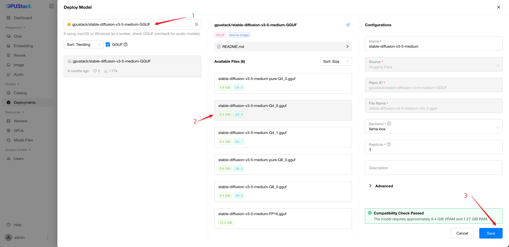

# 使用图像生成模型

GPUStack 支持部署和运行最先进的**图像生成模型**。这些模型允许你从文本描述生成令人惊艳的图像，适用于设计、内容创作等场景。

在本指南中，我们将带你完成在 GPUStack 中部署和使用图像生成模型的流程。

## 前提条件

开始之前，请确保具备以下条件：

- 至少 12 GB 显存的 GPU。
- 可访问 Hugging Face 以下载模型文件。
- 已安装并运行 GPUStack。如未安装，请参阅[快速入门指南](../quickstart.md)。

## 步骤 1：部署 Stable Diffusion 模型

按以下步骤从 Hugging Face 部署模型：

1. 在 GPUStack UI 中进入 `Deployments` 页面。
2. 点击 `Deploy Model` 按钮。
3. 在下拉菜单中选择 `Hugging Face` 作为模型来源。
4. 使用左上角的搜索栏搜索模型名称 `gpustack/stable-diffusion-v3-5-medium-GGUF`。
5. 在 `Available Files` 部分选择 `stable-diffusion-v3-5-medium-Q4_0.gguf` 文件。
6. 保持其他设置为默认，点击 `Save` 按钮部署模型。



部署完成后，你可以在 `Deployments` 页面监控模型部署状态。


## 步骤 2：使用模型进行图像生成

1. 在 GPUStack UI 中进入 `Playground` > `Image` 页面。
2. 确认右上角 `Model` 下拉菜单中已选中已部署的模型。
3. 输入描述你想生成图像的提示词。例如：

```
一位女性角色，长而飘逸的头发，仿佛由缥缈的旋转图案构成，类似北极光（极光）。背景以深蓝和紫色为主，营造出神秘而戏剧性的氛围。角色面容安详，皮肤苍白，五官立体醒目。她身着深色服饰，带有细微的纹样。整体画风让人联想到奇幻或超自然题材。
```

4. 在 `Sampler` 下拉菜单中选择 `euler`。
5. 将 `Sample Steps` 设置为 `20`。
6. 点击 `Submit` 按钮生成图像。

生成的图像将显示在界面中。由于种子和生成过程中的随机性，你的图像可能会有所不同。


## 总结

完成上述设置后，你可以通过文本提示生成独特且富有视觉冲击力的图像。尝试不同的提示词和参数设置，探索更多可能性。更多详情请参阅[图像生成模型的推荐参数](recommended-parameters-for-image-generation-models.md)