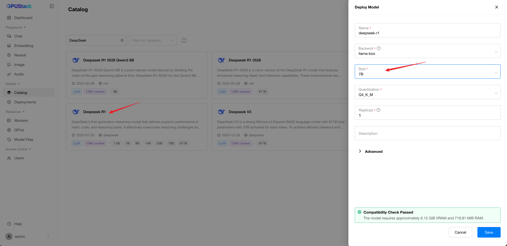

# 使用大语言模型

**大语言模型（LLMs）** 是能够理解并生成类人文本的强大 AI 模型，广泛应用于聊天机器人、内容生成、代码补全等场景。

在本指南中，您将学习如何在 GPUStack 中部署并与 LLM 交互。

## 前置条件

开始之前，请确保具备以下条件：

- 一台具备一个或多个 GPU 的 Linux 机器，总显存至少 30 GB。我们将使用仅支持 Linux 的 vLLM 后端。
- 可访问 [Hugging Face](https://huggingface.co/) 或 [ModelScope](https://www.modelscope.cn/) 以下载模型文件。
- 已安装并运行 GPUStack。如未安装，请参阅[快速开始指南](../quickstart.md)。

## 第一步：部署大语言模型

### 从目录部署

目录中的大语言模型以 `LLM` 分类标注。选择目录中的大语言模型时，只要您的 GPU 资源充足且后端与您的环境兼容（例如，vLLM 后端需要 amd64 Linux 工作节点），默认配置即可正常运行。

这里以部署 `DeepSeek R1` 为例。

1. 进入 GPUStack UI 的 `Deployments` 页面。
2. 点击 `Deploy Model` 按钮。
3. 在下拉菜单中选择 `Catalog` 作为模型来源。
4. 在目录列表页左上角搜索栏中输入关键词 `DeepSeek`。
5. 查看模型描述、最大上下文长度以及支持的参数规模。


#### 使用 llama-box 部署

1. 从目录中选择 `Deepseek R1`。
2. 在 Size 中选择 `7B`。
3. 点击 `Save` 按钮部署模型。



部署后，您可以在 `Deployments` 页面监控模型部署状态，并等待其启动运行。

#### 使用 vLLM 部署

1. 从目录中选择 `Deepseek R1`。
2. 由于模型名称即访问 ID，且不能与已创建的名称相同，请将默认模型名更改为 `deepseek-r1-vllm`。
3. 选择 `vLLM` 后端。
4. 在 Size 中选择 `7B`。
5. 点击 `Save` 按钮部署模型。


部署后，您可以在 `Deployments` 页面监控模型部署状态，并等待其启动运行。

## 第二步：使用 LLM 进行文本生成

1. 进入 GPUStack UI 的 `Playground` > `Chat` 页面。
2. 在右上角的 `Model` 下拉菜单中确认选择已部署的模型。
3. 输入用于文本生成的提示。例如：

```
2, 4, 6, 8, > 下一个数字是什么？
```

4. 根据需要调整右侧的 `Parameters`。
5. 点击 `Submit` 按钮生成文本。

生成的思维链和结果将显示在 UI 中。


按照上述步骤，您即可在 GPUStack 中利用 LLM 进行 AI 驱动的文本生成与自然语言任务。尝试不同的提示和参数设置，探索 LLM 的全部能力！