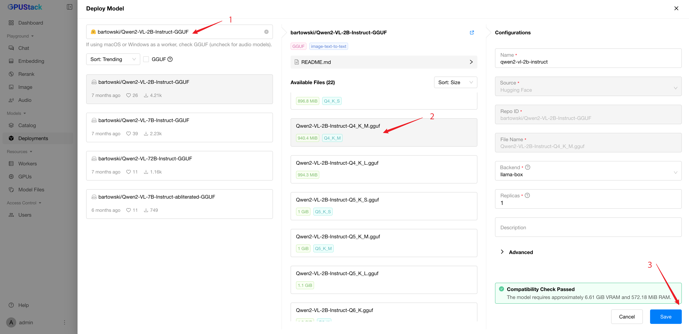
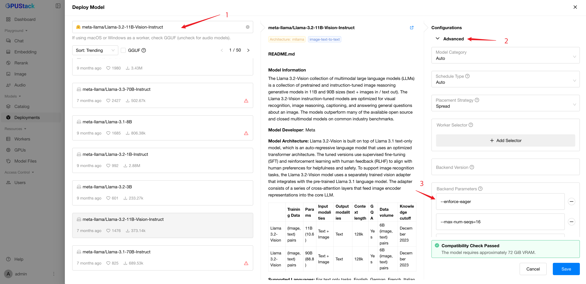

# 使用视觉语言模型

视觉语言模型（Vision Language Models，VLMs）能够同时处理视觉（图像）与语言（文本）数据，因而可用于图像描述、视觉问答等多种应用。本指南将介绍如何在 GPUStack 中部署和使用视觉语言模型（VLMs）。

在 GPUStack 中部署和交互这些模型的流程相似，主要区别在于部署模型时需要设置的参数。关于可配置参数的详细说明，请参阅[后端参数](../user-guide/inference-backends.md#parameters-reference_1)。

本指南将涵盖以下模型的部署：

- Llama3.2-Vision
- Qwen2-VL
- Pixtral
- Phi3.5-Vision

## 先决条件

开始前，请确保你具备以下条件：

- 一台具有一个或多个 GPU 的 Linux 机器，总计至少 30 GB 显存。我们将使用仅支持 Linux 的 vLLM 后端。
- 可以访问 Hugging Face，并持有用于下载模型文件的 [Hugging Face API 密钥](https://huggingface.co/settings/tokens)。
- 已在 Hugging Face 上获得上述模型的访问权限。[Llama3.2-VL](https://huggingface.co/meta-llama/Llama-3.2-11B-Vision-Instruct) 和 [Pixtral](https://huggingface.co/mistralai/Pixtral-12B-2409) 为受限模型，你需要申请访问权限。

!!! note

    本指南全程使用配备一块 H100（80GB）GPU 的 Ubuntu 节点。

## 步骤 1：安装 GPUStack

请先确保系统已安装 [Docker](https://docs.docker.com/engine/install/) 和 [NVIDIA Container Toolkit](https://docs.nvidia.com/datacenter/cloud-native/container-toolkit/install-guide.html)。然后运行以下命令启动 GPUStack 服务器。

```bash
docker run -d --name gpustack \
      --restart=unless-stopped \
      --gpus all \
      --network=host \
      --ipc=host \
      -v gpustack-data:/var/lib/gpustack \
      gpustack/gpustack \
      --huggingface-token <Hugging Face API Key>
```

将 `<Hugging Face API Key>` 替换为你的 [Hugging Face API 密钥](https://huggingface.co/settings/tokens)。GPUStack 会使用该密钥下载模型文件。

关于安装或其他 GPU 硬件平台的更多信息，请参阅[安装文档](../installation/installation-requirements.md)。

## 步骤 2：登录 GPUStack UI

服务器启动后，运行以下命令获取默认管理员密码：

```bash
docker exec gpustack cat /var/lib/gpustack/initial_admin_password
```

在浏览器中访问 `http://your_host_ip` 打开 GPUStack UI。使用默认用户名 `admin` 和上一步获取的密码登录。

## 步骤 3：部署视觉语言模型

### 从目录部署

目录中的视觉语言模型带有 `vision` 能力标识。当你从目录中选择一个视觉语言模型时，只要 GPU 资源充足且后端与环境兼容（例如 vLLM 后端需要 amd64 Linux worker 节点），默认配置通常即可正常工作。


### 使用 llama-box 的自定义部署示例

使用 llama-box 部署 GGUF 格式的 VLM 模型时，GPUStack 会自动处理多模态投影器文件，开箱即用。

1. 在 GPUStack UI 中进入 `Deployments` 页面，点击 `Deploy Model` 按钮。在下拉菜单中选择 `Hugging Face` 作为模型来源。
2. 勾选 `GGUF` 复选框以按 GGUF 格式筛选模型。
3. 在搜索栏中查找 `bartowski/Qwen2-VL-2B-Instruct-GGUF` 模型。
4. 使用 GGUF `Q4_K_M` 量化格式。
5. 点击 `Save` 按钮部署模型。



### 使用 vLLM 的自定义部署示例

#### 部署 Llama3.2-Vision

1. 进入 `Deployments` 页面。
2. 点击 `Deploy Model` 按钮，然后在下拉菜单中选择 `Hugging Face`。
3. 在搜索栏中搜索 `meta-llama/Llama-3.2-11B-Vision-Instruct`。
4. 在配置中展开 `Advanced` 区域，向下滚动至 `Backend Parameters` 部分。
5. 多次点击 `Add Parameter` 按钮，添加以下参数：

- `--enforce-eager`
- `--max-num-seqs=16`
- `--max-model-len=8192`

6. 点击 `Save` 按钮。



#### 部署 Qwen2-VL

1. 进入 `Deployments` 页面。
2. 点击 `Deploy Model` 按钮，然后选择 `Hugging Face`。
3. 在搜索栏中搜索 `Qwen/Qwen2-VL-7B-Instruct`。
4. 点击 `Save` 按钮。只要 GPU 资源充足，默认配置即可正常工作。

#### 部署 Pixtral

1. 进入 `Deployments` 页面。
2. 点击 `Deploy Model` 按钮，然后选择 `Hugging Face`。
3. 在搜索栏中搜索 `mistralai/Pixtral-12B-2409`。
4. 在配置中展开 `Advanced` 区域，向下滚动至 `Backend Parameters` 部分。
5. 多次点击 `Add Parameter` 按钮，添加以下参数：

- `--tokenizer-mode=mistral`
- `--limit-mm-per-prompt=image=4`

6. 点击 `Save` 按钮。

#### 部署 Phi3.5-Vision

1. 进入 `Deployments` 页面。
2. 点击 `Deploy Model` 按钮，然后选择 `Hugging Face`。
3. 在搜索栏中搜索 `microsoft/Phi-3.5-vision-instruct`。
4. 在配置中展开 `Advanced` 区域，向下滚动至 `Backend Parameters` 部分。
5. 点击 `Add Parameter` 按钮并添加以下参数：

- `--trust-remote-code`

6. 点击 `Save` 按钮。

## 步骤 4：与视觉语言模型交互

1. 进入 `Chat` 页面。
2. 在右上角下拉菜单中选择已部署的模型。
3. 点击输入框上方的 `Upload Image` 按钮并上传一张图片。
4. 在输入框中输入提示词。例如：“请描述这张图片。”
5. 点击 `Submit` 按钮生成输出。

